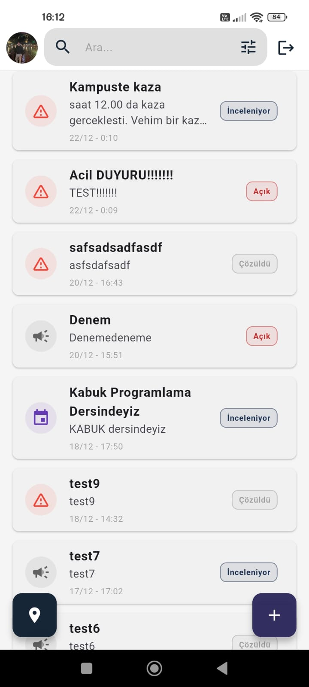
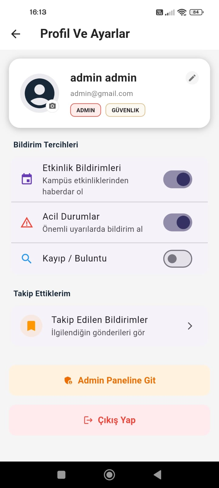
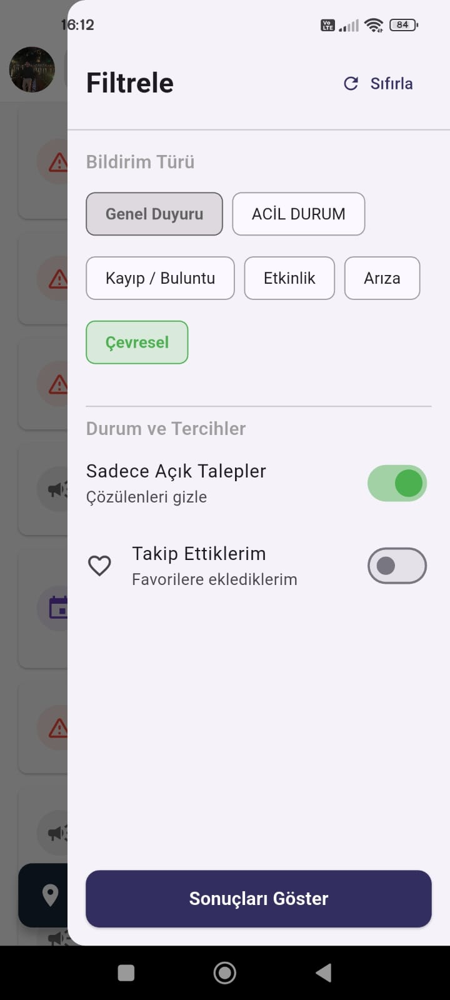

# KAMPÜS BİLDİRİM UYGULAMASI
## Teknik Proje Raporu

---

<div align="center">

**ATATÜRK ÜNİVERSİTESİ**  
**MÜHENDİSLİK FAKÜLTESİ**  
**BİLGİSAYAR MÜHENDİSLİĞİ BÖLÜMÜ**

---

### MOBİL PROGRAMLAMA DERSİ  
### DÖNEM PROJESİ

---

**Proje Adı:** Kampüs Bildirim Sistemi  
**Platform:** Android / iOS (Cross-Platform)  
**Geliştirme Tarihi:** Aralık 2025  
**Versiyon:** 1.0.0

</div>

---

## İÇİNDEKİLER

1. [Proje Özeti](#1-proje-özeti)
2. [Kullanılan Teknolojiler](#2-kullanılan-teknolojiler)
3. [Sistem Mimarisi](#3-sistem-mimarisi)
4. [Ekran Listesi ve Ekran Görüntüleri](#4-ekran-listesi-ve-ekran-görüntüleri)
5. [Veritabanı Tasarımı](#5-veritabanı-tasarımı)
6. [Güvenlik ve Yetkilendirme](#6-güvenlik-ve-yetkilendirme)
7. [Uygulama Akış Diyagramları](#7-uygulama-akış-diyagramları)
8. [Sonuç ve Değerlendirme](#8-sonuç-ve-değerlendirme)

---

## 1. PROJE ÖZETİ

### 1.1 Projenin Amacı ve Kapsamı

Kampüs Bildirim Uygulaması, üniversite kampüsü içerisinde meydana gelen çeşitli olayların (acil durumlar, kayıp eşyalar, etkinlikler, arızalar, çevresel sorunlar) kullanıcılar tarafından hızlı ve kolay bir şekilde bildirilmesini, takip edilmesini ve yönetilmesini sağlayan kapsamlı bir mobil uygulamadır.

Modern üniversite kampüslerinde iletişim ve bilgi akışı kritik öneme sahiptir. Bu uygulama, geleneksel bildirim yöntemlerinin (telefon, e-posta, dilekçe) yerine gerçek zamanlı, konum tabanlı ve görsel destekli bir çözüm sunarak kampüs yaşamını daha güvenli ve verimli hale getirmeyi amaçlamaktadır.

### 1.2 Problem Tanımı

Üniversite kampüslerinde karşılaşılan temel sorunlar:

| Problem | Açıklama |
|---------|----------|
| **İletişim Gecikmesi** | Acil durumların ilgili birimlere ulaşmasının zaman alması |
| **Konum Belirsizliği** | Bildirilen olayın tam yerinin tespit edilememesi |
| **Takip Eksikliği** | Bildirimin işlem durumunun takip edilememesi |
| **Görsel Kanıt** | Olayın boyutunun anlaşılması için fotoğraf paylaşım zorluğu |
| **Merkezi Yönetim** | Tüm bildirimlerin tek bir platformda toplanamaması |

### 1.3 Çözüm Yaklaşımı

Uygulamamız bu problemlere şu çözümleri sunmaktadır:

- **Anlık Bildirim**: Mobil uygulama üzerinden saniyeler içinde bildirim oluşturma
- **GPS Entegrasyonu**: Otomatik konum belirleme ile tam adres tespiti
- **Görsel Destek**: Fotoğraf ekleme özelliği ile olayın belgelenmesi
- **Gerçek Zamanlı Takip**: Firebase Firestore ile anlık durum güncellemeleri
- **Push Notification**: Durum değişikliklerinde anlık bilgilendirme
- **Harita Görünümü**: Tüm bildirimlerin harita üzerinde görselleştirilmesi

### 1.4 Hedef Kitle

| Kullanıcı Tipi | Özellikler | Yetkiler |
|----------------|------------|----------|
| **Öğrenci** | Kampüste aktif olarak bulunan | Bildirim oluşturma, takip etme |
| **Akademik Personel** | Öğretim üyeleri ve görevlileri | Bildirim oluşturma, takip etme |
| **İdari Personel** | Kampüs hizmet birimleri | Bildirim oluşturma, takip etme |
| **Admin (Yönetici)** | Kampüs yönetim ekibi | Tüm yetkiler + yönetim paneli |

### 1.5 Bildirim Kategorileri

Uygulama 6 farklı bildirim kategorisi desteklemektedir:

| Kategori | Açıklama | İkon | Renk | Örnek Kullanım |
|----------|----------|------|------|----------------|
| **Acil Durum** | Hayati tehlike içeren durumlar | ⚠️ | 🔴 Kırmızı | Yangın, kaza, sağlık acili |
| **Kayıp/Buluntu** | Kaybedilen veya bulunan eşyalar | 🔍 | 🔵 Mavi | Kayıp telefon, bulunan cüzdan |
| **Etkinlik** | Kampüs etkinlikleri | 🎉 | 🟢 Yeşil | Konferans, konser, seminer |
| **Arıza** | Teknik sorunlar | 🔧 | 🟠 Turuncu | Elektrik kesintisi, asansör arızası |
| **Çevresel** | Çevre ile ilgili sorunlar | 🌿 | 🟣 Mor | Çöp birikimi, gürültü kirliliği |
| **Genel** | Diğer duyurular | 📢 | ⚪ Gri | Genel bilgilendirmeler |

### 1.6 Bildirim Durumları

Her bildirim üç farklı durumda olabilir:

| Durum | Açıklama | Renk |
|-------|----------|------|
| **Açık** | Yeni oluşturulmuş, henüz işleme alınmamış | 🟡 Sarı |
| **İnceleniyor** | Yönetim tarafından değerlendiriliyor | 🔵 Mavi |
| **Çözüldü** | İşlem tamamlanmış | 🟢 Yeşil |

---

## 2. KULLANILAN TEKNOLOJİLER

### 2.1 Geliştirme Ortamı

| Araç | Versiyon | Kullanım Amacı |
|------|----------|----------------|
| **Visual Studio Code** | 1.85+ | Kod editörü |
| **Android Studio** | Hedgehog | Android emülatör ve SDK |
| **Xcode** | 15+ | iOS simülatör (macOS) |
| **Git** | 2.40+ | Versiyon kontrol |
| **GitHub** | - | Uzak repository |

### 2.2 Frontend Teknolojileri

#### 2.2.1 Flutter Framework
Flutter, Google tarafından geliştirilen açık kaynaklı bir UI framework'üdür. Tek bir kod tabanından Android ve iOS için native performansta uygulamalar geliştirmeye olanak sağlar.

| Özellik | Açıklama |
|---------|----------|
| **Hot Reload** | Anlık kod değişikliği görüntüleme |
| **Widget Tabanlı** | Her şey widget olarak tasarlanır |
| **Native Performans** | ARM koda derleme |
| **Tek Kod Tabanı** | Android ve iOS için ortak kod |

#### 2.2.2 Dart Programlama Dili
Dart, Flutter için optimize edilmiş, nesne yönelimli, tip güvenli bir programlama dilidir.

```dart
// Örnek Dart kodu - Bildirim modeli
class AppNotification {
  final String id;
  final String title;
  final String content;
  final NotificationType type;
  final NotificationStatus status;
  final double latitude;
  final double longitude;
  
  AppNotification({
    required this.id,
    required this.title,
    required this.content,
    required this.type,
    required this.status,
    required this.latitude,
    required this.longitude,
  });
}
```

#### 2.2.3 State Management - Riverpod
Riverpod, Flutter uygulamalarında durum yönetimi için kullanılan modern ve güvenli bir çözümdür.

| Provider Tipi | Kullanım Amacı |
|---------------|----------------|
| **Provider** | Değişmeyen değerler |
| **StateProvider** | Basit state yönetimi |
| **StreamProvider** | Gerçek zamanlı veri akışı (Firestore) |
| **FutureProvider** | Asenkron veri çekme |

```dart
// Örnek Provider kullanımı
final notificationsProvider = StreamProvider<List<AppNotification>>((ref) {
  return FirebaseFirestore.instance
      .collection('notifications')
      .orderBy('createdAt', descending: true)
      .snapshots()
      .map((snapshot) => snapshot.docs
          .map((doc) => AppNotification.fromFirestore(doc))
          .toList());
});
```

#### 2.2.4 Navigasyon - GoRouter
GoRouter, Flutter için deklaratif navigasyon çözümü sunar.

```dart
// Route tanımları
GoRouter(
  routes: [
    GoRoute(path: '/home', builder: (_, __) => HomePage()),
    GoRoute(path: '/notification/:id', builder: (_, state) => 
        NotificationDetailPage(id: state.pathParameters['id']!)),
    GoRoute(path: '/map', builder: (_, state) => 
        MapPage(focusNotification: state.extra as AppNotification?)),
  ],
)
```

### 2.3 Backend Teknolojileri (Firebase)

#### 2.3.1 Firebase Authentication
Kullanıcı kimlik doğrulama servisi.

| Özellik | Açıklama |
|---------|----------|
| **Email/Password** | E-posta ve şifre ile giriş |
| **Şifre Sıfırlama** | E-posta ile şifre yenileme |
| **Oturum Yönetimi** | Otomatik oturum persistance |
| **Güvenlik** | SSL/TLS şifreleme |

#### 2.3.2 Cloud Firestore
NoSQL belge tabanlı veritabanı.

| Özellik | Açıklama |
|---------|----------|
| **Gerçek Zamanlı** | Anlık veri senkronizasyonu |
| **Offline Destek** | İnternet olmadan çalışma |
| **Ölçeklenebilir** | Otomatik ölçeklendirme |
| **Güvenlik Kuralları** | Veri erişim kontrolü |

#### 2.3.3 Firebase Storage
Dosya depolama servisi.

| Kullanım | Açıklama |
|----------|----------|
| **Bildirim Resimleri** | `/notification_images/{timestamp}.jpg` |
| **Profil Fotoğrafları** | `/profile_images/{userId}.jpg` |

#### 2.3.4 Firebase Cloud Messaging (FCM)
Push notification servisi.

| Bildirim Tipi | Renk | Kullanım |
|---------------|------|----------|
| **Acil Durum** | 🔴 Kırmızı | Acil bildirimler |
| **Durum Güncellemesi** | 🔵 Mavi | Normal güncellemeler |

#### 2.3.5 Cloud Functions
Sunucu taraflı işlemler.

```javascript
// FCM tetikleme fonksiyonu
exports.sendFCMOnMarkerUpdate = functions.firestore
  .document('notifications/{notificationId}')
  .onUpdate(async (change, context) => {
    const newData = change.after.data();
    const oldData = change.before.data();
    
    if (newData.status !== oldData.status) {
      // FCM gönder
    }
  });
```

### 2.4 Harici Kütüphaneler

| Kütüphane | Versiyon | Kullanım Amacı |
|-----------|----------|----------------|
| **google_maps_flutter** | 2.14.0 | Harita görüntüleme |
| **geolocator** | 14.0.2 | GPS konum alma |
| **geocoding** | 4.0.0 | Koordinat-adres çevirme |
| **image_picker** | 1.2.1 | Galeriden resim seçme |
| **uuid** | 4.5.2 | Benzersiz ID oluşturma |
| **intl** | 0.20.2 | Tarih/saat formatlama |

---

## 3. SİSTEM MİMARİSİ

### 3.1 Genel Mimari Diyagramı

```
┌─────────────────────────────────────────────────────────────────┐
│                        KULLANICI ARAYÜZÜ                         │
│                     (Flutter - Dart)                             │
├─────────────────────────────────────────────────────────────────┤
│  ┌─────────┐  ┌─────────┐  ┌─────────┐  ┌─────────┐  ┌────────┐ │
│  │ Ana     │  │ Harita  │  │ Profil  │  │ Admin   │  │ Detay  │ │
│  │ Sayfa   │  │ Sayfası │  │ Sayfası │  │ Paneli  │  │ Sayfası│ │
│  └────┬────┘  └────┬────┘  └────┬────┘  └────┬────┘  └────┬───┘ │
│       │            │            │            │            │      │
│       └────────────┴────────────┴────────────┴────────────┘      │
│                              │                                    │
│                    ┌─────────┴─────────┐                         │
│                    │    RIVERPOD       │                         │
│                    │ (State Management)│                         │
│                    └─────────┬─────────┘                         │
├──────────────────────────────┼──────────────────────────────────┤
│                     REPOSITORY LAYER                             │
│  ┌──────────────────┐  ┌──────────────────┐                     │
│  │ NotificationRepo │  │   AuthRepo       │                     │
│  └────────┬─────────┘  └────────┬─────────┘                     │
├───────────┼─────────────────────┼───────────────────────────────┤
│           │      FIREBASE       │                                │
│  ┌────────┴────────┐  ┌────────┴────────┐  ┌──────────────────┐ │
│  │   Firestore     │  │ Authentication  │  │    Storage       │ │
│  │  (Database)     │  │   (Auth)        │  │   (Files)        │ │
│  └─────────────────┘  └─────────────────┘  └──────────────────┘ │
│                              │                                    │
│                    ┌─────────┴─────────┐                         │
│                    │  Cloud Functions  │                         │
│                    │     (FCM)         │                         │
│                    └───────────────────┘                         │
└─────────────────────────────────────────────────────────────────┘
```

### 3.2 Klasör Yapısı

```
lib/
├── main.dart                     # Uygulama giriş noktası
├── firebase_options.dart         # Firebase konfigürasyonu
│
├── models/                       # Veri Modelleri
│   ├── app_notification.dart     # Bildirim modeli (279 satır)
│   └── app_user.dart             # Kullanıcı modeli (52 satır)
│
├── pages/                        # Ekran Sayfaları
│   ├── splash_page.dart          # Açılış ekranı
│   ├── login_page.dart           # Giriş/kayıt ekranı (512 satır)
│   ├── home_page.dart            # Ana sayfa (440 satır)
│   ├── add_notification_page.dart # Bildirim ekleme (414 satır)
│   ├── notification_detail_page.dart # Bildirim detay (563 satır)
│   ├── map_page.dart             # Harita sayfası (180 satır)
│   ├── profile_page.dart         # Profil sayfası (310 satır)
│   ├── followed_notifications_page.dart # Takip edilenler
│   ├── admin_panel_page.dart     # Admin paneli
│   └── admin_actions_page.dart   # Admin işlemleri
│
├── components/                   # Yeniden Kullanılabilir Bileşenler
│   ├── custom_toast.dart         # Özel toast mesajları
│   ├── notification_status_badge.dart # Durum rozeti
│   ├── notification_filter_drawer.dart # Filtreleme drawer'ı
│   ├── map_notification_card.dart # Harita bildirim kartı
│   ├── profile_info_card.dart    # Profil bilgi kartı
│   ├── sender_info_card.dart     # Gönderici bilgi kartı
│   ├── section_title.dart        # Bölüm başlığı
│   └── status_tag.dart           # Durum etiketi
│
├── providers/                    # Riverpod Provider'ları
│   ├── notification_provider.dart # Bildirim provider'ları
│   └── user_provider.dart        # Kullanıcı provider'ları
│
├── repository/                   # Veri Erişim Katmanı
│   ├── notification_repository.dart # Bildirim CRUD (627 satır)
│   └── auth_repository.dart      # Kimlik doğrulama
│
├── services/                     # Servis Sınıfları
│   ├── auth_service.dart         # Kimlik doğrulama servisi
│   ├── location_service.dart     # Konum servisi
│   └── store_img_service.dart    # Resim yükleme servisi
│
├── routes/                       # Navigasyon
│   └── app_router.dart           # Route tanımları
│
└── constants/                    # Sabitler
    └── app_colors.dart           # Uygulama renkleri
```

### 3.3 Veri Akış Diyagramı

```
┌──────────┐     ┌──────────┐     ┌──────────┐     ┌──────────┐
│ Kullanıcı│────>│   UI     │────>│ Provider │────>│Repository│
│          │     │ (Widget) │     │(Riverpod)│     │          │
└──────────┘     └──────────┘     └──────────┘     └────┬─────┘
                      ▲                                  │
                      │                                  ▼
                      │           ┌──────────────────────────────┐
                      │           │         FIREBASE             │
                      └───────────│  ┌────────┐  ┌────────────┐  │
                   (Stream)       │  │Firestore│  │   Auth     │  │
                                  │  └────────┘  └────────────┘  │
                                  └──────────────────────────────┘
```

---

## 4. EKRAN LİSTESİ VE EKRAN GÖRÜNTÜLERİ

Bu bölümde uygulamanın tüm ekranları detaylı olarak açıklanmış ve ekran görüntüleri ile desteklenmiştir.

---

### 4.1 Splash Screen (Açılış Ekranı)

**Dosya:** `lib/pages/splash_page.dart`

Uygulama başlatıldığında gösterilen ilk ekrandır. Bu ekranda:
- Firebase bağlantısı kontrol edilir
- Kullanıcının oturum durumu kontrol edilir
- Oturum açıksa ana sayfaya, değilse giriş sayfasına yönlendirilir

**Teknik Detaylar:**
- `StreamProvider` ile auth state dinlenir
- 2 saniyelik minimum gösterim süresi
- Uygulama logosu ve yükleme animasyonu

---

### 4.2 Giriş/Kayıt Ekranı (Login Page)

**Dosya:** `lib/pages/login_page.dart` (512 satır)

Kullanıcıların sisteme giriş yapabildiği veya yeni hesap oluşturabildiği ekrandır.

**Özellikler:**
- Tab yapısı ile Giriş/Kayıt geçişi
- E-posta validasyonu (regex)
- Şifre güvenlik kontrolü (minimum 6 karakter)
- Şifre sıfırlama özelliği
- FCM token kaydetme

**Form Alanları (Kayıt):**

| Alan | Tip | Validasyon |
|------|-----|------------|
| Ad | Text | Zorunlu |
| Soyad | Text | Zorunlu |
| Departman | Text | Zorunlu |
| E-posta | Email | Regex kontrolü |
| Şifre | Password | Min 6 karakter |

**Ekran Görüntüleri:**

| Giriş Ekranı | Kayıt Ekranı |
|:------------:|:------------:|
|  |  |
| *Şekil 4.2.1: Kullanıcı giriş formu* | *Şekil 4.2.2: Yeni kullanıcı kayıt formu* |

---

### 4.3 Ana Sayfa (Home Page)

**Dosya:** `lib/pages/home_page.dart` (440 satır)

Tüm bildirimlerin listelendiği ana ekrandır. Uygulama açıldığında kullanıcının karşılaştığı ilk işlevsel ekrandır.

**Özellikler:**
- Gerçek zamanlı bildirim listesi (Firestore Stream)
- Arama çubuğu ile anlık filtreleme
- Filtreleme drawer'ı (tip, durum, departman)
- Bildirim kartlarında tip ikonu ve renk kodlaması
- Durum rozeti gösterimi
- FAB butonları (Harita + Bildirim Ekleme)
- Pull-to-refresh özelliği

**Bildirim Kartı İçeriği:**
- Bildirim başlığı
- Bildirim tipi ikonu ve etiketi
- Durum rozeti (Açık/İnceleniyor/Çözüldü)
- Oluşturulma tarihi
- Takip edilen bildirimlerde kalp ikonu

**Ekran Görüntüleri:**

| Ana Sayfa | Bildirim Listesi | Filtreleme |
|:---------:|:----------------:|:----------:|
|  |  |  |
| *Şekil 4.3.1: Ana sayfa görünümü* | *Şekil 4.3.2: Farklı bildirim türleri* | *Şekil 4.3.3: Filtreleme drawer'ı* |

---

### 4.4 Bildirim Ekleme Sayfası (Add Notification Page)

**Dosya:** `lib/pages/add_notification_page.dart` (414 satır)

Yeni bildirim oluşturma formunu içeren ekrandır.

**Özellikler:**
- Başlık girişi (zorunlu)
- Açıklama girişi (zorunlu, çok satırlı)
- Bildirim tipi seçimi (dropdown)
- GPS ile otomatik konum alma
- Galeriden resim ekleme (opsiyonel)
- Form validasyonu
- Yükleme durumu gösterimi

**Form Alanları:**

| Alan | Tip | Zorunlu | Açıklama |
|------|-----|---------|----------|
| Başlık | TextField | ✅ | Bildirimin kısa başlığı |
| Açıklama | TextField (multiline) | ✅ | Detaylı açıklama |
| Tür | DropdownButton | ✅ | 6 kategori seçeneği |
| Konum | GPS Button | ✅ | Otomatik konum alma |
| Resim | ImagePicker | ❌ | Galeriden seçim |

**Ekran Görüntüleri:**

| Form Görünümü | Konum ve Resim |
|:-------------:|:--------------:|
|  |  |
| *Şekil 4.4.1: Bildirim ekleme formu* | *Şekil 4.4.2: Konum ve resim ekleme* |

---

### 4.5 Bildirim Detay Sayfası (Notification Detail Page)

**Dosya:** `lib/pages/notification_detail_page.dart` (563 satır)

Seçilen bildirimin tüm detaylarını gösteren ekrandır.

**Özellikler:**
- Bildirim resmi (tam ekran görüntüleme)
- Başlık ve açıklama
- Tip ikonu ve renk kodlaması
- Durum rozeti
- Mini harita ile konum gösterimi
- Takip et/bırak butonu
- Gönderici bilgi kartı
- "Konumda Gör" FAB butonu

**Admin Özellikleri:**
- Durum güncelleme (3 buton)
- İçerik düzenleme (dialog)
- Bildirimi sonlandırma (soft delete)

**Ekran Görüntüleri:**

| Detay Görünümü | Admin Paneli |
|:--------------:|:------------:|
|  |  |
| *Şekil 4.5.1: Bildirim detay sayfası* | *Şekil 4.5.2: Admin yönetim görünümü* |

---

### 4.6 Harita Sayfası (Map Page)

**Dosya:** `lib/pages/map_page.dart` (180 satır)

Tüm bildirimlerin harita üzerinde marker olarak gösterildiği ekrandır.

**Özellikler:**
- Google Maps entegrasyonu
- Bildirim tipine göre renkli marker'lar
- Marker'a tıklayınca bildirim kartı
- Kullanıcı konumuna gitme butonu
- Detay sayfasına yönlendirme
- Bildiriming konumuna odaklanma (detaydan gelindiğinde)

**Marker Renkleri:**

| Bildirim Tipi | Marker Rengi |
|---------------|--------------|
| Acil Durum | 🔴 Kırmızı |
| Kayıp/Buluntu | 🔵 Mavi |
| Etkinlik | 🟢 Yeşil |
| Arıza | 🟠 Turuncu |
| Çevresel | 🟣 Mor |
| Genel | ⚪ Gri |

**Ekran Görüntüleri:**

| Harita Görünümü | Marker Detay |
|:---------------:|:------------:|
|  |  |
| *Şekil 4.6.1: Tüm bildirimler haritada* | *Şekil 4.6.2: Marker bildirim kartı* |

---

### 4.7 Profil Sayfası (Profile Page)

**Dosya:** `lib/pages/profile_page.dart` (310 satır)

Kullanıcı profil bilgileri ve uygulama ayarlarının yönetildiği ekrandır.

**Özellikler:**
- Profil fotoğrafı görüntüleme/değiştirme
- Ad/Soyad düzenleme
- E-posta görüntüleme
- Departman ve rol bilgisi
- Bildirim tercihleri (switch'ler)
- Takip edilen bildirimlere erişim
- Admin paneli erişimi (sadece admin)
- Çıkış yapma

**Bildirim Tercihleri:**

| Tercih | Varsayılan | Açıklama |
|--------|------------|----------|
| Etkinlik Bildirimleri | ✅ | Kampüs etkinlikleri |
| Acil Durumlar | ✅ | Önemli uyarılar |
| Kayıp/Buluntu | ❌ | Kayıp eşya bildirimleri |

**Ekran Görüntüleri:**

| Profil Sayfası | Düzenleme |
|:--------------:|:---------:|
|  |  |
| *Şekil 4.7.1: Profil bilgileri* | *Şekil 4.7.2: Ad/Soyad düzenleme* |

---

### 4.8 Takip Edilenler Sayfası (Followed Notifications)

**Dosya:** `lib/pages/followed_notifications_page.dart` (129 satır)

Kullanıcının takip ettiği bildirimlerin listelendiği ekrandır.

**Özellikler:**
- Takip edilen bildirimlerin listesi
- Bildirim tipi ve durum gösterimi
- Detay sayfasına yönlendirme
- Boş durum mesajı

**Ekran Görüntüsü:**


*Şekil 4.8.1: Takip edilen bildirimler listesi*

---

### 4.9 Admin Paneli (Admin Panel)

**Dosya:** `lib/pages/admin_panel_page.dart`

Yönetici işlemlerinin gerçekleştirildiği özel paneldir.

**Özellikler:**
- Kullanıcı listesi görüntüleme
- Kullanıcı arama
- Rol değiştirme (user ↔ admin)
- Acil duyuru oluşturma
- Sistem istatistikleri

**Ekran Görüntüleri:**

| Admin Paneli | İşlemler |
|:------------:|:--------:|
|  |  |
| *Şekil 4.9.1: Kullanıcı yönetimi* | *Şekil 4.9.2: Admin işlemleri* |

---

### 4.10 Ek Ekran Görüntüleri

Uygulamanın farklı durumlarını gösteren ek ekran görüntüleri:

| Görüntü 1 | Görüntü 2 | Görüntü 3 |
|:---------:|:---------:|:---------:|
|  |  |  |
| *Şekil 4.10.1* | *Şekil 4.10.2* | *Şekil 4.10.3* |

| Görüntü 4 | Görüntü 5 |
|:---------:|:---------:|
|  |  |
| *Şekil 4.10.4* | *Şekil 4.10.5* |

---

## 5. VERİTABANI TASARIMI

### 5.1 Firestore Veri Modeli

Cloud Firestore, doküman tabanlı NoSQL bir veritabanıdır. Veriler koleksiyonlar (collections) içindeki dokümanlarda (documents) saklanır.

### 5.2 Koleksiyonlar

#### 5.2.1 users (Kullanıcılar)

**Yol:** `/users/{userId}`

| Alan | Tip | Zorunlu | Açıklama |
|------|-----|---------|----------|
| `uid` | string | ✅ | Firebase Auth user ID |
| `email` | string | ✅ | E-posta adresi |
| `name` | string | ✅ | Kullanıcı adı |
| `surname` | string | ✅ | Kullanıcı soyadı |
| `department` | string | ✅ | Departman/Bölüm |
| `role` | string | ✅ | "user" veya "admin" |
| `avatarUrl` | string | ❌ | Profil fotoğrafı URL'i |
| `fcmToken` | string | ❌ | Push notification token |

**Örnek Doküman:**
```json
{
  "uid": "abc123xyz",
  "email": "ahmet.yilmaz@atauni.edu.tr",
  "name": "Ahmet",
  "surname": "Yılmaz",
  "department": "Bilgisayar Mühendisliği",
  "role": "user",
  "avatarUrl": "https://storage.firebase.com/...",
  "fcmToken": "dK8xJ2..."
}
```

#### 5.2.2 notifications (Bildirimler)

**Yol:** `/notifications/{notificationId}`

| Alan | Tip | Zorunlu | Açıklama |
|------|-----|---------|----------|
| `id` | string | ✅ | Benzersiz bildirim ID |
| `title` | string | ✅ | Bildirim başlığı |
| `content` | string | ✅ | Bildirim içeriği |
| `type` | string | ✅ | Bildirim türü (enum) |
| `status` | string | ✅ | Bildirim durumu (enum) |
| `latitude` | number | ✅ | Enlem koordinatı |
| `longitude` | number | ✅ | Boylam koordinatı |
| `address` | string | ❌ | Konum adresi |
| `imageUrl` | string | ❌ | Bildirim resmi URL'i |
| `senderId` | string | ✅ | Gönderen kullanıcı ID |
| `createdAt` | timestamp | ✅ | Oluşturulma zamanı |
| `isDeleted` | boolean | ✅ | Soft delete flag |
| `followers` | array | ✅ | Takip eden kullanıcı ID'leri |
| `lastUpdatedBy` | string | ❌ | Son güncelleyen admin ID |
| `lastUpdatedByName` | string | ❌ | Son güncelleyen admin adı |

**Örnek Doküman:**
```json
{
  "id": "notif_abc123",
  "title": "Kütüphanede Kayıp Telefon",
  "content": "Merkez kütüphane 3. katta siyah iPhone bulundu...",
  "type": "lostFound",
  "status": "open",
  "latitude": 39.9055,
  "longitude": 41.2658,
  "address": "Atatürk Üniversitesi Merkez Kütüphane",
  "imageUrl": "https://storage.firebase.com/...",
  "senderId": "user123",
  "createdAt": "2025-12-28T14:30:00Z",
  "isDeleted": false,
  "followers": ["user456", "user789"],
  "lastUpdatedBy": null,
  "lastUpdatedByName": null
}
```

### 5.3 Veri İlişkileri

```
┌─────────────────┐         ┌─────────────────┐
│     users       │         │  notifications  │
├─────────────────┤         ├─────────────────┤
│ uid (PK)        │◄────────│ senderId (FK)   │
│ email           │         │ id (PK)         │
│ name            │         │ title           │
│ surname         │         │ content         │
│ department      │◄────────│ followers[]     │
│ role            │         │ type            │
│ avatarUrl       │         │ status          │
│ fcmToken        │         │ latitude        │
└─────────────────┘         │ longitude       │
                            └─────────────────┘
```

### 5.4 İndeksler

| Koleksiyon | İndeks Alanları | Tür |
|------------|-----------------|-----|
| notifications | `createdAt DESC` | Composite |
| notifications | `type, status` | Composite |
| notifications | `senderId, createdAt` | Composite |
| notifications | `isDeleted, createdAt` | Composite |

---

## 6. GÜVENLİK VE YETKİLENDİRME

### 6.1 Firebase Authentication

Uygulama, Firebase Authentication servisini kullanarak güvenli kullanıcı kimlik doğrulama sağlar.

**Desteklenen Yöntemler:**
- E-posta ve şifre ile giriş
- Şifre sıfırlama (e-posta ile)

**Güvenlik Önlemleri:**
- SSL/TLS şifreleme
- Şifre hash'leme (bcrypt)
- Oturum token yönetimi
- Brute force koruması

### 6.2 Firestore Security Rules

```javascript
rules_version = '2';
service cloud.firestore {
  match /databases/{database}/documents {
    // Kullanıcılar
    match /users/{userId} {
      allow read: if request.auth != null;
      allow write: if request.auth != null && request.auth.uid == userId;
      allow update: if request.auth != null && 
                      get(/databases/$(database)/documents/users/$(request.auth.uid)).data.role == 'admin';
    }
    
    // Bildirimler
    match /notifications/{notificationId} {
      allow read: if request.auth != null;
      allow create: if request.auth != null;
      allow update: if request.auth != null;
      allow delete: if request.auth != null && 
                      get(/databases/$(database)/documents/users/$(request.auth.uid)).data.role == 'admin';
    }
  }
}
```

### 6.3 Yetki Matrisi

| İşlem | Misafir | Kullanıcı | Admin |
|-------|---------|-----------|-------|
| Bildirimleri görüntüle | ❌ | ✅ | ✅ |
| Bildirim oluştur | ❌ | ✅ | ✅ |
| Bildirim takip et | ❌ | ✅ | ✅ |
| Kendi profilini düzenle | ❌ | ✅ | ✅ |
| Bildirim durumu güncelle | ❌ | ❌ | ✅ |
| Bildirim sil | ❌ | ❌ | ✅ |
| Kullanıcı rolü değiştir | ❌ | ❌ | ✅ |
| Admin paneli erişimi | ❌ | ❌ | ✅ |

---

## 7. UYGULAMA AKIŞ DİYAGRAMLARI

### 7.1 Kullanıcı Giriş Akışı

```
┌──────────┐     ┌──────────┐     ┌──────────┐     ┌──────────┐
│  Splash  │────>│ Auth     │────>│  Login   │────>│   Home   │
│  Screen  │     │ Check    │     │  Page    │     │   Page   │
└──────────┘     └──────────┘     └──────────┘     └──────────┘
                      │                                  ▲
                      │ (Oturum açık)                   │
                      └────────────────────────────────┘
```

### 7.2 Bildirim Oluşturma Akışı

```
┌──────────┐     ┌──────────┐     ┌──────────┐     ┌──────────┐
│   Home   │────>│   Add    │────>│   GPS    │────>│  Submit  │
│   Page   │     │  Form    │     │  Konum   │     │          │
└──────────┘     └──────────┘     └──────────┘     └──────────┘
                      │                                  │
                      ▼                                  ▼
                ┌──────────┐                      ┌──────────┐
                │  Image   │                      │ Firestore│
                │  Picker  │                      │  Write   │
                └──────────┘                      └──────────┘
```

### 7.3 Push Notification Akışı

```
┌──────────┐     ┌──────────┐     ┌──────────┐     ┌──────────┐
│  Admin   │────>│ Firestore│────>│  Cloud   │────>│   FCM    │
│  Update  │     │  Update  │     │ Function │     │   Send   │
└──────────┘     └──────────┘     └──────────┘     └──────────┘
                                                        │
                                                        ▼
                                                  ┌──────────┐
                                                  │ Kullanıcı│
                                                  │  Cihazı  │
                                                  └──────────┘
```

---

## 8. SONUÇ VE DEĞERLENDİRME

### 8.1 Proje Başarıları

Kampüs Bildirim Uygulaması, belirlenen hedeflere ulaşmış ve aşağıdaki başarıları elde etmiştir:

| Hedef | Durum | Açıklama |
|-------|-------|----------|
| Cross-platform destek | ✅ Başarılı | Android ve iOS'ta çalışıyor |
| Gerçek zamanlı güncelleme | ✅ Başarılı | Firestore Stream ile anlık |
| GPS entegrasyonu | ✅ Başarılı | Otomatik konum belirleme |
| Push notification | ✅ Başarılı | FCM ile bildirim gönderimi |
| Admin yönetimi | ✅ Başarılı | Kapsamlı admin paneli |
| Kullanıcı deneyimi | ✅ Başarılı | Modern ve sezgisel arayüz |

### 8.2 Teknik Kazanımlar

Bu proje sürecinde aşağıdaki teknolojiler ve kavramlar öğrenilmiş ve uygulanmıştır:

- **Flutter/Dart** ile mobil uygulama geliştirme
- **Firebase** ekosistemi (Auth, Firestore, Storage, FCM, Functions)
- **Riverpod** ile state management
- **GoRouter** ile navigasyon yönetimi
- **Google Maps** entegrasyonu
- **Clean Architecture** prensipleri
- **Git** ile versiyon kontrolü

### 8.3 Gelecek Geliştirmeler

| Özellik | Öncelik | Açıklama |
|---------|---------|----------|
| Offline mod | 🔴 Yüksek | İnternet olmadan çalışma |
| Kategori aboneliği | 🟠 Orta | Sadece ilgili kategorilerden bildirim |
| İstatistik paneli | 🟠 Orta | Detaylı raporlama |
| Web versiyonu | 🟡 Düşük | Flutter Web ile |
| AI sınıflandırma | 🟡 Düşük | Otomatik kategori önerisi |
| Çoklu dil desteği | 🟡 Düşük | İngilizce, Türkçe |

### 8.4 Sonuç

Kampüs Bildirim Uygulaması, modern mobil uygulama geliştirme teknolojileri kullanılarak geliştirilmiş, üniversite kampüslerindeki iletişim ve bilgi akışı problemlerine etkili bir çözüm sunan kapsamlı bir projedir.

Proje, Flutter framework'ünün cross-platform yeteneklerini, Firebase'in güçlü backend servislerini ve Riverpod'un modern state management yaklaşımını bir araya getirerek, kullanıcı dostu, performanslı ve ölçeklenebilir bir uygulama ortaya koymuştur.

---

<div align="center">

**KAMPÜS BİLDİRİM UYGULAMASI**  
*Mobil Programlama Dersi Projesi*

---

**Hazırlayan:** Proje Ekibi  
**Tarih:** 28 Aralık 2025  
**Versiyon:** 1.0.0

</div>
